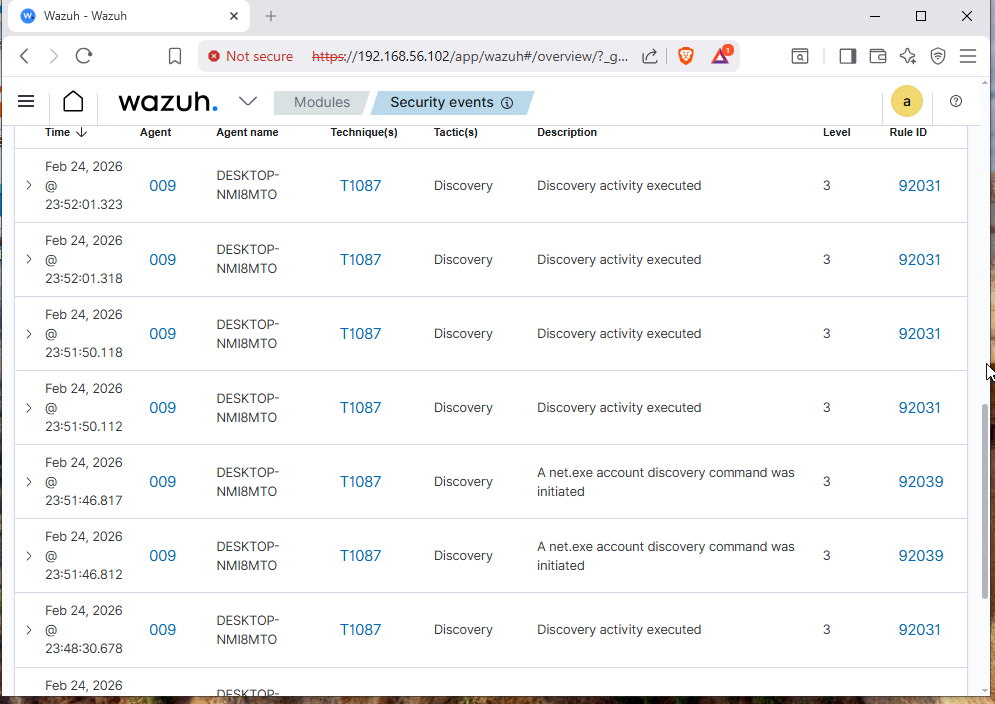
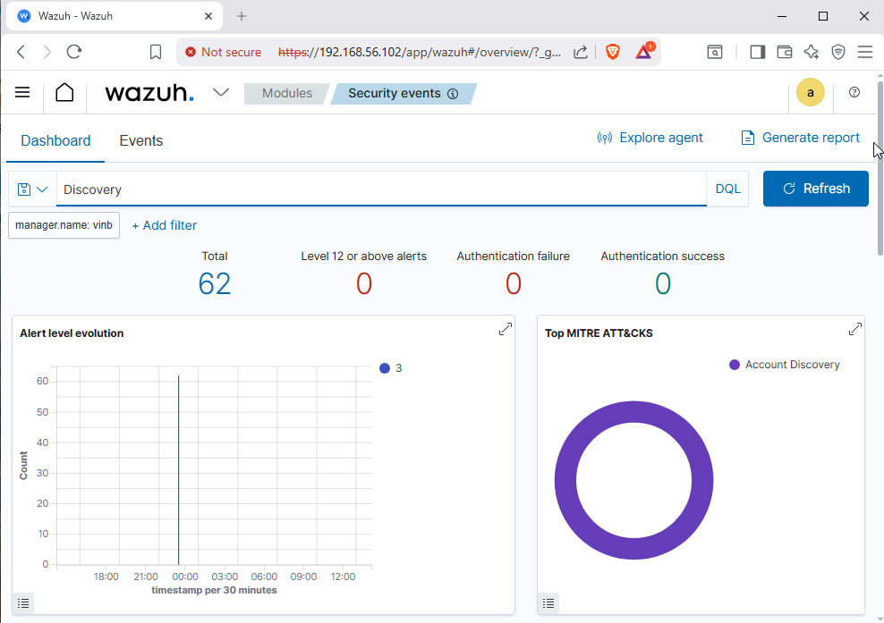

🛡 Active Directory Attack Simulation – SOC Lab
📌 Project Overview

This project demonstrates an Active Directory attack simulation performed inside a controlled home SOC lab environment.

The objective was to simulate real-world attacker reconnaissance activity and analyze how it is detected using Wazuh SIEM with Sysmon telemetry and MITRE ATT&CK mapping.
----------------------------------------------------------------------------------------------------------------------------------------------------------------
🧪 Lab Environment

Windows Server 2019 (Domain Controller)

Windows 10 (Domain-Joined Endpoint)

Active Directory Domain: corp.local

Wazuh SIEM (Manager + Dashboard)

Sysmon installed on endpoint

MITRE ATT&CK integration enabled
------------------------------------------------------------------------------------------------------------------------------------------------------------------
🎯 Attack Scenario Simulated
Domain Enumeration (Reconnaissance)

The following commands were executed on a domain-joined machine:

net user /domain
net group /domain
net group "Domain Admins" /domain

These commands simulate attacker behavior after initial access to enumerate domain users and privileged groups.
------------------------------------------------------------------------------------------------------------------------------------------------------------------
🔍 Detection Observed

Wazuh successfully detected and generated alerts for:

MITRE Technique: T1087 – Account Discovery

Rule ID: 92039

Alert Level: 3

Log Source: Windows Security Events

Enriched via Sysmon telemetry

The alerts were visualized in the Wazuh Security Events dashboard with MITRE ATT&CK mapping.
-------------------------------------------------------------------------------------------------------------------------------------------------------------------
📎 Skills Demonstrated

Active Directory
Windows Security Monitoring
Wazuh SIEM
Sysmon Configuration
MITRE ATT&CK Mapping
Threat Detection & Analysis
SOC Operations
------------------------------------------------------------------------------------------------------------------------------------------------------------------

## 🧪 Enumeration Execution

## 🚨 Detection – MITRE T1087 (Account Discovery)

## 📊 Wazuh Dashboard Overview

